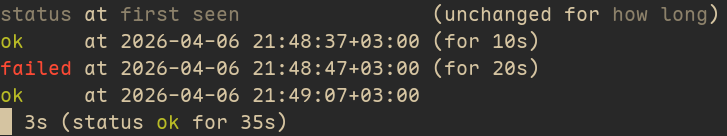

# Availability tracker

Track availability of address/IP over time

Usage:

```sh
cargo install --git https://github.com/istudyatuni/availability-tracker
track-availability https://example.com
```

Sample output:


